# This Repository is Reinforcement Learning Agent FrameWork

This repository is designed to provide an easy demo reinforcement learning framework for those studying deep reinforcement learning.

This framework is based on a tensorflow. And the basic model is implemented in example_model directory. If you want to use your own model, please refer provided model in example_model directory

We provide a tutorial to train the agent for the environment, and tutorials by action and input shape are provided as follows.


Environment

```
Continuous Action MLP - bipedalwalker, pendulum
Discrete Action MLP - LunarLander
Discrete Action CNN - Breakout
```

Algorithms

```
Continuous Action MLP - DDPG, TD3, PPO, PPO2
Discrete Action MLP - Vanilla PG, A2C, PPO, DQN, QRDQN, IQN
Discrete Action CNN - Vanilla PG, A2C, PPO, DQN, QRDQN, IQN
```

Our tutorial is being done in the gym environment provided by openai and you need to install the openai gym and box2d to run the tutorial code.

## Installation
from git repository
```
https://github.com/RLOpensource/tensorflow_RL
pip install .
```

cpu version

```
pip install tensorflow-rl[tf-cpu]
```

gpu version
```
pip install tensorflow-rl[tf-gpu]
```

If you install this repository by only

```
pip install tensorflow-rl
```

tensorflow is not installed

## Requirements

```
tensorflow
box2d
gym
numpy
tensorboardX
```

## Implemented

- [x] Vanilla Policy Gradient
- [x] Advantage Actor Critic
- [x] Proximal Policy Optimization
- [x] Deep Deterministic Policy Gradient
- [x] Value based Reinforcement Learning
- [ ] Soft Actor Critic
- [ ] LSTM train Algorithm

## Demonstration

### 1. Continuous Action BipedalWalker  

* Script : bipedalwalker_td3.py, bipedalwalker_ddpg.py, bipedalwalker_ppo.py, bipedalwalker_ppo2.py
* Environment : BipedalWalker-v2 
* Orange : td3, Blue: ddpg, SkyBlue: ppo, Pink: ppo2
* Episode : 600
* Image : td3

###### BipedalWalker
<div align="center">
  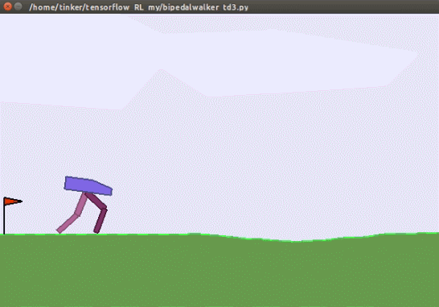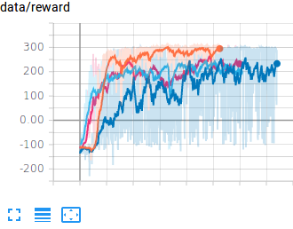
</div>

### 2. Continuous Action Pendulum

* Script : pendulum_td3.py, pendulum_ddpg.py  
* Environment : Pendulum-v0
* Orange : ddpg, Blue: td3
* Episode : 300
* Image : td3

###### Pendulum
<div align="center">
  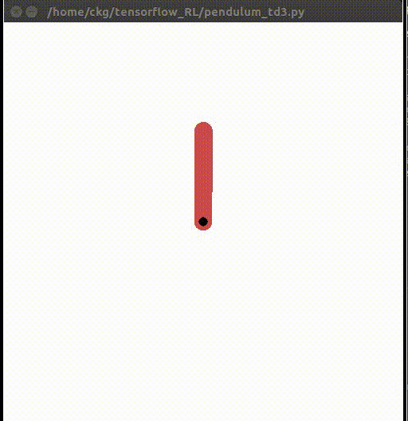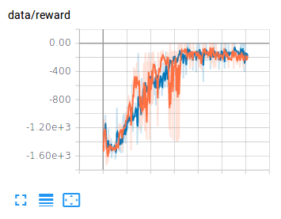
</div>

### 3. Discrete Action CNN Breakout

* Script : breakout_rollout_a2c.py, breakout_rollout_ppo.py, breakout_rollout_vpg.py
* Environment : BreakoutDeterministic-v4 with Multi-processing
* Blue : ppo, Orange : a2c, Red : vpg
* Episode : 600
* Image : PPO

###### Breakout
<div align="center">
  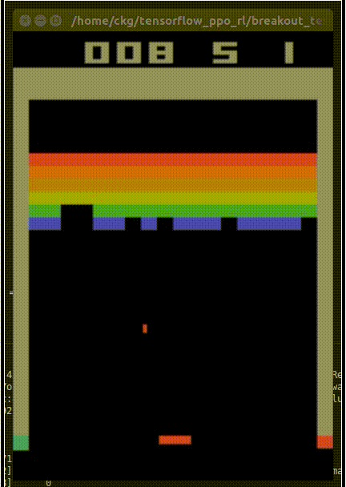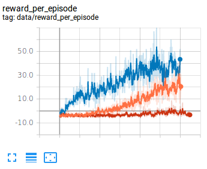
</div>

### 4. Discrete Action MLP LunarLander

* Script : lunarLander_rollout_a2c.py, lunarLander_rollout_ppo.py, lunarLander_rollout_vpg.py
* Environment : LunarLander-v2 with Multi-processing
* Blue : ppo, Orange : a2c, Red : vpg
* Episode : 350
* Image : PPO

###### LunarLander
<div align="center">
  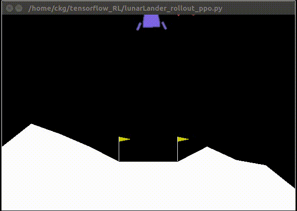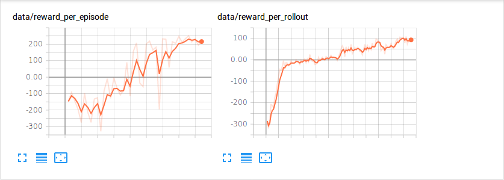
</div>

### 5. Value Based Reinforcement Learning with CNN

* Script : breakout_value_dqn.py, breakout_value_qrdqn.py, breakout_value_iqn.py
* Environment : BreakoutDeterministic-v4 with Multi-processing
* Green : IQN, Blue : QRDQN, Pink : DQN
* Episode : 280
* Image : IQN


###### Breakout
<div align="center">
  
  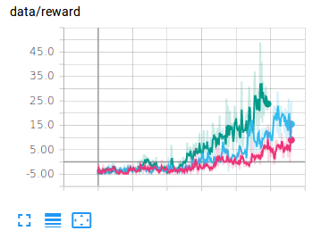
</div>

### 6. Value Based Reinforcement Learning with MLP

* Script : lunarLander_value_dqn.py, lunarLander_value_qrdqn.py, lunarLander_value_iqn.py
* Environment : LunarLander-v2 with Multi-processing
* Orange : IQN, Blue : QRDQN, Red : DQN
* Episode : 250
* Image : IQN

###### Breakout
<div align="center">
  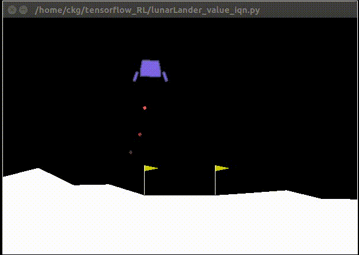
  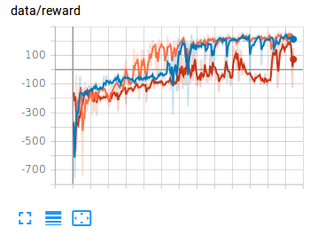
</div>

### 7. Discrete Action CNN LSTM Breakout inspired from drqn

* Script : breakout_rollout_ppo_1stack_lstm.py, breakout_rollout_ppo_1stack.py
* Environment : BreakoutDeterministic-v4 with Multi-processing
* Orange : PPOLSTM, Blue : PPO-1stack
* Episode : 1000
* Image : PPOLSTM

###### Breakout
<div align="center">
  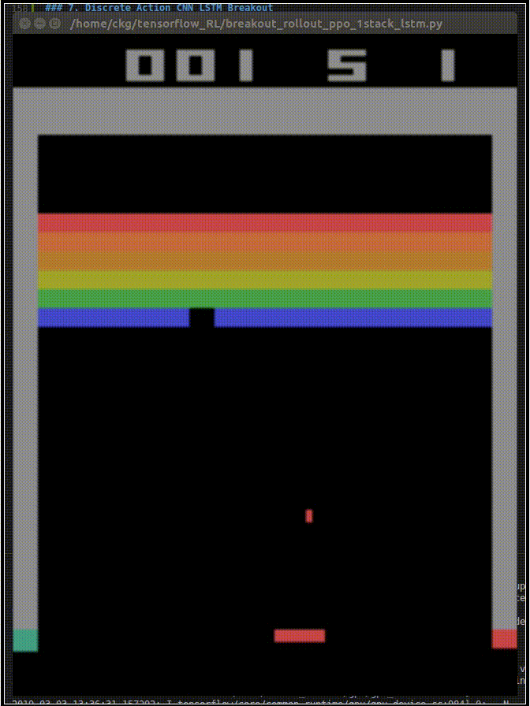
  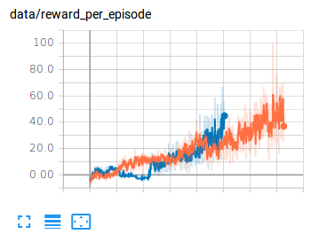
</div>

## Member

- [https://github.com/chagmgang](https://github.com/chagmgang)
- [https://github.com/SunandBean](https://github.com/SunandBean)
- [https://github.com/TinkTheBoush](https://github.com/TinkTheBoush)

## License

We do not have the copyright to this repository.

Please 'just' use these code and just 'refer' the url of repository in any form.

[MIT License](./LICENSE)

## Reference

[1] [mario_rl](https://github.com/jcwleo/mario_rl)

[2] [Proximal Policy Optimization](https://arxiv.org/abs/1707.06347)

[3] [Efficient Parallel Methods for Deep Reinforcement Learning](https://arxiv.org/abs/1705.04862)

[4] [High-Dimensional Continuous Control Using Generalized Advantage Estimation](https://arxiv.org/abs/1506.02438)

[5] [Asynchronous Methods for Deep Reinforcement Learning](https://arxiv.org/abs/1602.01783)

[6] [Continuous Control With Deep Reinforcement Learning](https://arxiv.org/pdf/1509.02971.pdf)

[7] [Vanilla Policy Gradient](https://spinningup.openai.com/en/latest/algorithms/vpg.html)

[8] [Deep Recurrent Q-Learning for Partially Observable MDPs](https://arxiv.org/pdf/1507.06527.pdf)

[9] [Playing Atari with Deep Reinforcement Learning](https://arxiv.org/pdf/1312.5602v1.pdf)

[10] [Distributional Reinforcement Learning with Quantile Regression](https://arxiv.org/abs/1710.10044)

[11] [Implicit Quantile Networks for Distributional Reinforcement Learning
](https://arxiv.org/abs/1806.06923)

[12] [OpenAI Spinningup](https://github.com/openai/spinningup)

[13] [Reinforcement Learning Korea PG Travel](https://github.com/reinforcement-learning-kr/pg_travel)

[14] [Medipixel Reinforcement Learning Repository](https://github.com/medipixel/rl_algorithms)

### Please fork this repository and contribute to strengthen the tensorflow reinforcement learning ecosystem

### Support us in any form. Thank you

Content us to [chagmgang@gmail.com](chagmgang@gmail.com)

test
